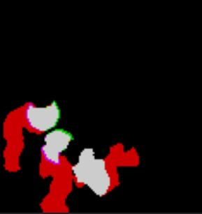

# FogOfWar

Unity下实现的渲染可见区域的战争迷雾

一、支持：

1、基于视野（FOV）的战争迷雾

2、简单圆形区域的战争迷雾

3、可以预计算场景障碍物信息

4、提供接口访问战争迷雾纹理，理论上可以方便的制作具备战争迷雾效果的小地图功能。

5、编辑器下预览战争迷雾纹理信息：

​	

二、使用说明：

1.FogOfWarEffect为战争迷雾渲染组件，需要添加到主摄像机

2.FogOfWarExplorer为探索者，添加该组件的物体将渲染可见区域（己方）

3.FogOfWarStalker为潜行者，添加该组件的物体在迷雾区域将不可见（敌方）
